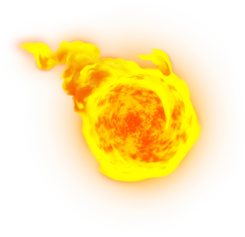
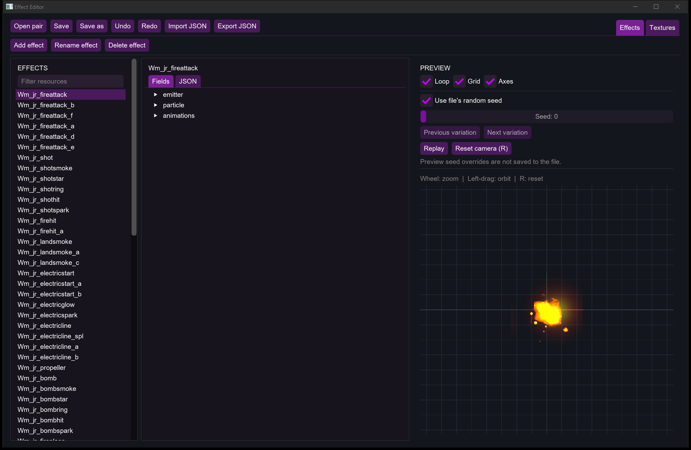

<p align="center"></p>

# Wii Effect Editor

A native C++ editor for Wii BREFF effect and BREFT texture archives, with an interactive preview powered by [Aurora](https://github.com/encounter/aurora).



## Features

- Edit effects with structured fields, color pickers, and animation controls, or edit JSON.
- Add, rename, and delete effects and textures. Inspect which effects reference each texture.
- Preview changes immediately, with looping, selectable random seeds, and optional grid and axes.
- Orbit with left-drag, zoom with the mouse wheel, and press **R** over the preview to reset the camera.
- Import and export JSON files as produced by [Actually-Working-BREFF-Converter](https://github.com/NSMBW-Community/Actually-Working-BREFF-Converter)

## Download

Get the latest successful build from the [rolling release](../../releases/tag/rolling). Extract the complete archive, then launch:

| Platform | Application |
| --- | --- |
| Windows x64 | `EffectEditor.exe` |
| Linux x64 | `./EffectEditor` |
| macOS Apple Silicon | `Effect Editor.app` |

Linux builds target Ubuntu 24.04 or newer and need a working Vulkan driver. The macOS build targets macOS 14 or newer on Apple Silicon and is not Apple-notarized.

## Build

Requires Git, CMake 3.25+, Ninja, and a C++20 compiler. On Windows, use a Visual Studio 2022 developer shell with the C++ workload installed. On macOS, use Xcode 26 or newer: Aurora requires `std::jthread` and `std::stop_token` from its C++ standard library. Linux packages are listed in [the build workflow](.github/workflows/build.yml).

```sh
cmake -S src -B build -G Ninja -DCMAKE_BUILD_TYPE=Release
cmake --build build --target breff_editor_native --parallel
cmake --install build --prefix dist/Wii-Effect-Editor --config Release --component EffectEditor
```

The first configuration downloads Aurora and its dependencies. The NW4R effect runtime is included in the repository.

